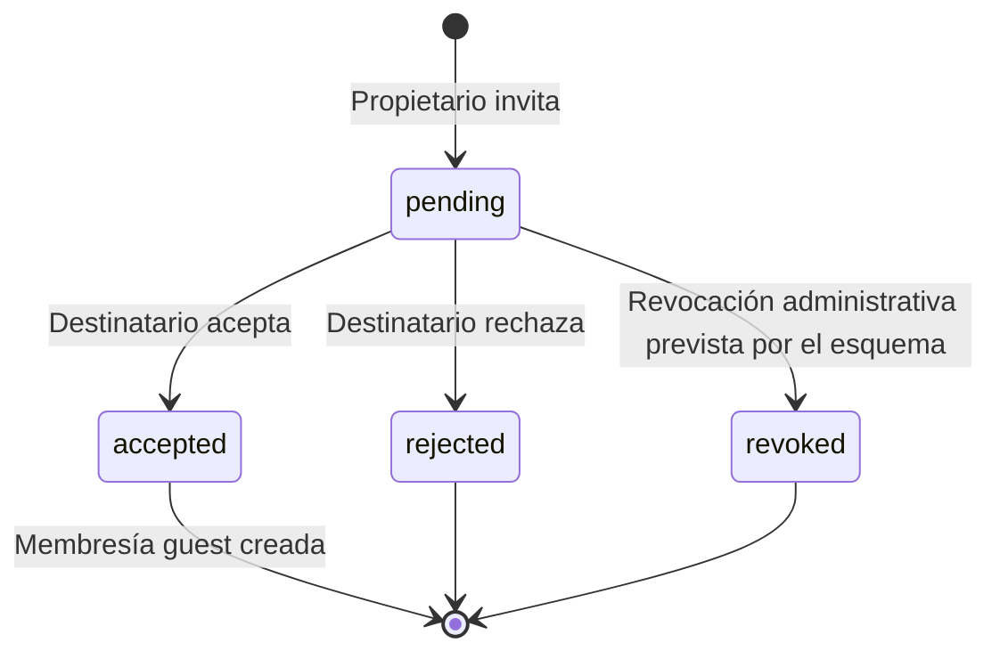
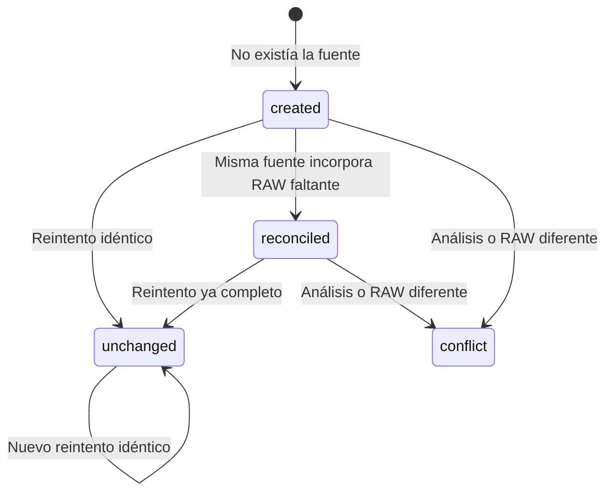
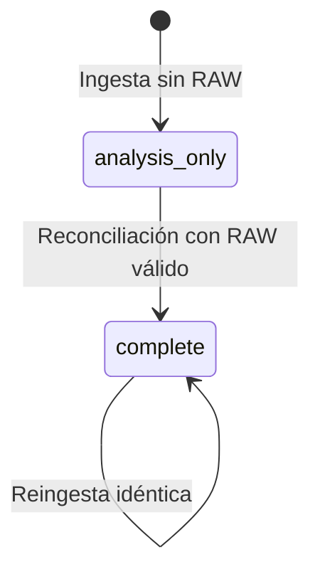
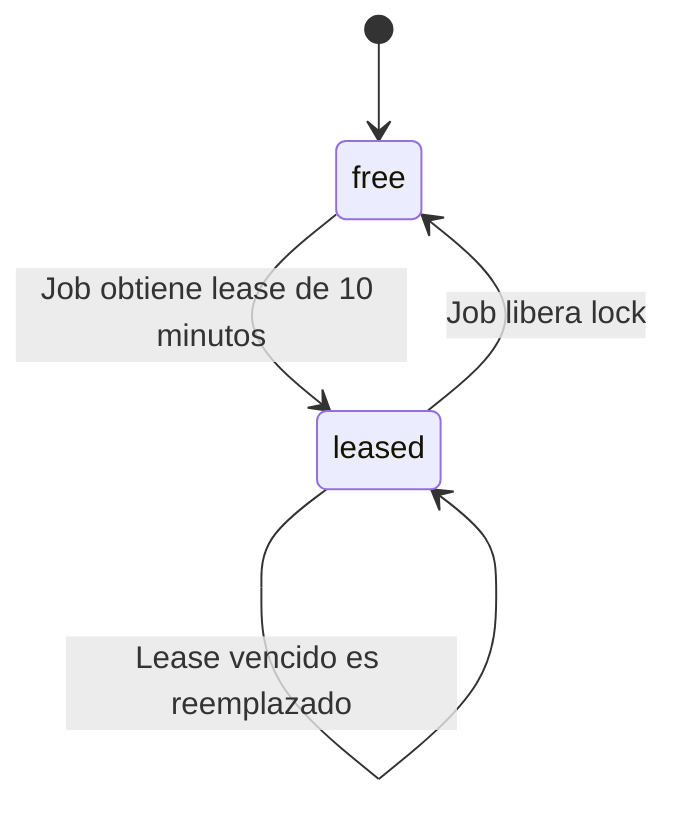
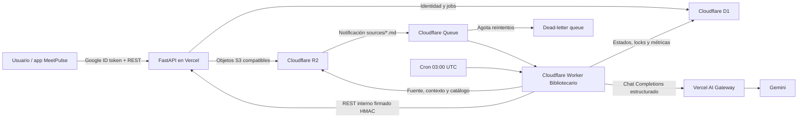

# MeetPulse Wiki: contexto de negocio, casos de uso y arquitectura

## Propósito y alcance

MeetPulse Wiki transforma reuniones analizadas y sus transcripciones en una memoria de proyecto durable, trazable y navegable. Su objetivo no es ser solamente un repositorio de archivos: busca convertirse en un **second brain** para las personas que participan en múltiples clientes y proyectos, manteniendo el contexto vigente, las decisiones, los riesgos y la evidencia que explica de dónde proviene cada afirmación.

La Wiki está diseñada para que tanto las personas como los LLM puedan recorrerla y mantenerla. Los usuarios reciben vistas legibles, índices, actividad y documentos Markdown; los agentes reciben rutas predecibles, metadatos estructurados, relaciones explícitas y evidencia verificable.

Este documento consolida el comportamiento observable en el repositorio. Cuando se describe una capacidad futura, se marca expresamente; no se asume como implementada.

## Problema de negocio

El conocimiento de un proyecto suele quedar fragmentado entre reuniones, transcripciones, resúmenes y la memoria de sus participantes. Esto produce pérdida de contexto, repetición de conversaciones, decisiones difíciles de justificar, riesgos que dejan de seguirse y una incorporación lenta de nuevos colaboradores.

MeetPulse Wiki aborda ese problema mediante cuatro capas:

1. **Evidencia primaria:** la transcripción RAW, preservada sin transformar.
2. **Fuente canónica:** el análisis de cada reunión, validado e inmutable en su contenido analítico.
3. **Conocimiento vigente:** contexto, decisiones y riesgos derivados, actualizados por el agente Bibliotecario.
4. **Navegación y operación:** índices, bitácora, dashboard, trabajos de procesamiento e identidad multi-tenant.

La propuesta de valor es que una persona pueda entender el estado de un proyecto sin reconstruir manualmente toda su historia y, al mismo tiempo, pueda volver desde una conclusión hasta la reunión que la sustenta.

## Principios de producto

- **La evidencia no se reescribe.** El RAW conserva los bytes originales y su hash SHA-256. El análisis canónico tampoco se reemplaza silenciosamente.
- **El conocimiento derivado declara su procedencia.** Todo contexto, decisión o riesgo apunta a una o más fuentes del mismo proyecto.
- **El contexto es acumulativo.** Una reunión nueva actualiza el estado global sin borrar información anterior, salvo contradicción explícita.
- **Las decisiones y riesgos son atómicos.** Se mantienen como documentos independientes, relacionables y fáciles de recuperar.
- **La estructura vive en las rutas.** Tenant, cliente y proyecto no se duplican en el frontmatter de documentos derivados.
- **La operación es idempotente.** Repetir una ingesta idéntica o un mantenimiento no debe duplicar ni alterar contenido.
- **La concurrencia se trata explícitamente.** ETags, escrituras condicionales y locks por proyecto evitan sobrescribir trabajo concurrente.
- **La IA administra conocimiento; no inventa hechos.** El agente debe distinguir decisiones reales, tareas, riesgos propios y hechos de terceros.
- **La Wiki sirve a humanos y máquinas.** Markdown legible, YAML estable, rutas deterministas e índices explícitos forman un mismo contrato.

## Actores y responsabilidades

### Usuario autenticado

Persona identificada mediante Google OAuth. Puede acceder únicamente a tenants de los que sea miembro, consultar la Wiki, ingerir reuniones y revisar el estado del procesamiento.

### Propietario del tenant (`owner`)

Además de las capacidades normales, crea el tenant, invita usuarios, revisa invitaciones y miembros, y revoca el acceso de invitados. Es el único rol autorizado para administrar usuarios del tenant.

### Invitado (`guest`)

Miembro aceptado de un tenant. Tiene acceso al contenido y operaciones normales del tenant, pero no puede administrar miembros ni invitaciones.

### Productor de análisis

Componente externo —por ejemplo, la aplicación desktop de MeetPulse— que entrega un archivo Markdown con el análisis de una reunión y, opcionalmente, la transcripción RAW. Debe respetar la estructura semántica mínima exigida por la API.

### Agente Bibliotecario

Agente de IA especializado en la administración de la Wiki. Consume reuniones nuevas, compara la fuente con el contexto vigente y el catálogo de conocimiento atómico, y propone una actualización coherente del contexto junto con decisiones y riesgos respaldados por evidencia.

No es el asistente conversacional del usuario. Su responsabilidad es conservar orden, trazabilidad, consistencia y continuidad dentro de cada proyecto.

### Operador de la plataforma

Configura Vercel, Cloudflare R2, D1, Queues, la DLQ, el evento de R2, el cron, Vercel AI Gateway y los secretos compartidos.

## Modelo de dominio

### Jerarquía de aislamiento

```text
tenant
└── client
    └── project
        ├── reuniones analizadas
        ├── contexto vigente
        ├── decisiones
        └── riesgos
```

- **Tenant:** espacio de colaboración con nombre globalmente único y membresía propia.
- **Cliente:** agrupación de proyectos dentro de un tenant.
- **Proyecto:** unidad principal de conocimiento y de serialización del Bibliotecario.
- **Fuente:** análisis canónico de una reunión.
- **RAW:** transcripción original asociada a una fuente.
- **Documento derivado:** contexto, decisión o riesgo generado o actualizado desde fuentes.
- **Trabajo del Bibliotecario:** registro operativo asociado de forma determinista a una fuente.

### Organización de objetos en R2

```text
raw/{tenant}/{client}/{project}/{fecha}-{slug}/{archivo-original}
sources/{tenant}/{client}/{project}/{fecha}-{slug}.md
wiki/{tenant}/index.md
wiki/{tenant}/log.md
wiki/{tenant}/{client}/index.md
wiki/{tenant}/{client}/{project}/index.md
wiki/{tenant}/{client}/{project}/context.md
wiki/{tenant}/{client}/{project}/decisions/*.md
wiki/{tenant}/{client}/{project}/risks/*.md
```

Los archivos `index.md` y `log.md` son artefactos operativos para navegación y mantenimiento; no son documentos OKF. La reunión canónica vive en `sources/`, mientras que `wiki/` contiene conocimiento consolidado.

### Contrato OKF

Todo documento de conocimiento derivado usa YAML frontmatter con estos campos obligatorios:

```yaml
---
type: context # context | meeting | decision | risk
title: Título autosuficiente
description: Descripción breve
sources:
  - sources/tenant/cliente/proyecto/2026-07-12-reunion.md
timestamp: 2026-07-12T19:30:00Z
---
```

Reglas relevantes:

- `title` y `description` no pueden estar vacíos.
- `timestamp` debe ser RFC 3339 en UTC y terminar en `Z`.
- `sources` debe ser una lista no vacía, sin duplicados y con objetos existentes.
- Toda fuente debe pertenecer al mismo tenant, cliente y proyecto del documento.
- `tenant_id`, `client_id` y `project_id` no deben repetirse en el YAML: la ruta ya expresa ese alcance.
- Los campos adicionales no pueden colisionar con campos requeridos o de alcance.
- Las relaciones `supersedes` y `related` de decisiones y riesgos solo pueden apuntar a claves atómicas del mismo proyecto.

## Historias de usuario

### Ingesta y preservación

- Como usuario miembro de un tenant, quiero cargar el análisis de una reunión para incorporarlo a la memoria del proyecto.
- Como usuario, quiero adjuntar la transcripción original para conservar evidencia primaria sin transformación.
- Como usuario, quiero saber si la fuente quedó completa o solo contiene el análisis, para evaluar su nivel de procedencia.
- Como usuario, quiero poder reintentar una carga idéntica sin duplicar documentos ni corromper índices.
- Como responsable de cumplimiento, quiero que un contenido distinto bajo la misma identidad sea rechazado, para evitar reemplazos silenciosos.
- Como operador, quiero poder exigir RAW mediante configuración, para adaptar el nivel de evidencia a cada entorno.

### Consulta y orientación

- Como usuario, quiero ver un resumen del tenant con clientes, proyectos, fuentes, páginas y última actividad.
- Como usuario, quiero navegar de tenant a cliente, de cliente a proyecto y del proyecto a sus fuentes y documentos derivados.
- Como usuario, quiero leer por separado el contexto vigente, cada reunión analizada, las decisiones y los riesgos.
- Como usuario, quiero ver la actividad reciente para saber qué conocimiento ingresó y qué produjo el Bibliotecario.
- Como usuario, quiero consultar el estado de procesamiento de una reunión para distinguir espera, ejecución, éxito o error.

### Colaboración y acceso

- Como usuario nuevo, quiero comprobar la disponibilidad de un nombre y crear un tenant propio.
- Como propietario, quiero invitar personas por correo para compartir la memoria de trabajo.
- Como invitado, quiero aceptar o rechazar una invitación destinada a mi correo verificado.
- Como propietario, quiero revisar miembros e invitaciones y revocar el acceso de un invitado.
- Como miembro, quiero que el sistema impida el acceso a tenants ajenos aunque conozca sus identificadores.

### Curación automática

- Como usuario, quiero que cada reunión nueva actualice el contexto global del proyecto sin tener que mantenerlo manualmente.
- Como usuario, quiero que solo los acuerdos formales se conviertan en decisiones, para evitar ruido.
- Como usuario, quiero que tareas y asuntos abiertos se mantengan en pendientes, en vez de confundirse con decisiones.
- Como usuario, quiero que solo amenazas explícitas para el proyecto se conviertan en riesgos.
- Como usuario, quiero que cada decisión o riesgo incluya impacto, siguiente paso y evidencia.
- Como usuario, quiero que el mantenimiento periódico repare el orden de índices y bitácoras sin cambiar el significado del conocimiento.

## Flujos de usuario

### 1. Alta y acceso a un tenant

1. El usuario inicia sesión con Google y entrega un ID token Bearer.
2. La API valida firma, emisor, audiencia y que el correo esté verificado.
3. El usuario consulta si el nombre deseado está disponible.
4. Al provisionar, el nombre se normaliza a un `tenant_id` globalmente único.
5. La API registra al usuario, crea el tenant y lo agrega como `owner`.
6. En solicitudes posteriores, la API comprueba que el usuario tenga un rol en el tenant solicitado.

### 2. Invitación y colaboración

1. El propietario crea una invitación para una dirección de correo.
2. La invitación queda `pending`.
3. El destinatario autenticado consulta sus invitaciones pendientes.
4. Si acepta, la invitación pasa a `accepted` y se crea una membresía `guest`.
5. Si rechaza, pasa a `rejected` y no se crea membresía.
6. El propietario puede revocar una membresía de invitado; el rol `owner` no se elimina mediante esa operación.

### 3. Ingesta de una reunión

1. El cliente envía `multipart/form-data` con alcance, título, fecha, participantes, análisis `.md` y RAW opcional `.md` o `.txt`.
2. La API valida autorización, identificadores, UTF-8, extensiones y estructura semántica del análisis.
3. La fecha se normaliza a UTC y se construye una clave determinista desde fecha y título.
4. Si hay RAW, se conserva como bytes, con tipo de contenido y SHA-256.
5. Se construye la fuente canónica preservando metadatos originales no administrados y agregando metadatos de alcance y procedencia.
6. Se crean, si faltan, índices de tenant, cliente y proyecto, contexto inicial y bitácora.
7. Se agregan enlaces sin duplicarlos y se registra la actividad.
8. Se crea un trabajo `pending` en D1; si D1 falla transitoriamente, la ingesta de R2 sigue siendo válida y el Worker puede reconstruir el trabajo.
9. La respuesta incluye `source_key`, `raw_key`, `provenance_status`, `ingest_status`, `job_id`, `processing_status` y claves actualizadas.

### 4. Reintento y reconciliación

1. Si análisis y procedencia son idénticos, la operación responde `unchanged`.
2. Si existe un análisis histórico sin RAW y llega la misma fuente con su transcripción, la API agrega procedencia y responde `reconciled`.
3. Si cambia el análisis bajo la misma clave, o el RAW no coincide con el hash registrado, la API responde `409`.
4. El contexto derivado no se reemplaza durante una simple reingesta.

### 5. Curación por el Bibliotecario

1. La creación o actualización de un objeto `sources/*.md` genera una notificación de R2 hacia Cloudflare Queue.
2. El Worker valida la configuración y el tipo de evento, deriva el alcance y asegura que exista un job.
3. Obtiene un lock con lease de diez minutos para serializar cambios del mismo proyecto.
4. Cambia el job a `running`, incrementa intentos y carga fuente, contexto vigente y catálogo de decisiones/riesgos.
5. Si existe un análisis de IA persistido y compatible, lo reutiliza; si no, invoca Gemini mediante Vercel AI Gateway.
6. Valida y normaliza la salida estructurada.
7. Firma el cuerpo con HMAC y llama a la API interna con el ETag del contexto leído.
8. La API valida fuente, job, alcance, referencias, documentos y ETag; crea documentos atómicos, actualiza el contexto y reconstruye el índice del proyecto.
9. El Worker marca el job `succeeded`, guarda métricas y claves producidas, limpia el payload intermedio y libera el lock.
10. Ante error reintentable, el job vuelve a `pending`; tras el umbral de entregas queda `failed` y el mensaje termina en la DLQ según la configuración de Queue.

### 6. Lectura y seguimiento

1. El usuario consulta KPIs, clientes, proyectos o actividad.
2. Selecciona un proyecto y lista sus documentos.
3. Lee el análisis sin el frontmatter administrado, o el documento OKF completo para contexto, decisión o riesgo.
4. Consulta el job asociado si necesita conocer intentos, modelo, latencia, consumo de tokens, error o salidas.

### 7. Mantenimiento nocturno

1. El cron de Cloudflare se ejecuta diariamente a las `03:00 UTC`.
2. Enumera tenants existentes bajo `wiki/` y encola un mensaje de mantenimiento por tenant.
3. La API interna normaliza y agrupa la bitácora por fecha.
4. Reconstruye índices de proyecto, cliente y tenant desde los objetos actuales.
5. Solo escribe archivos cuyo contenido cambió, por lo que la tarea es idempotente.

## Máquinas de estado

### Trabajo del Bibliotecario

```mermaid
stateDiagram-v2
    [*] --> pending: Ingesta o evento R2
    pending --> running: Lock adquirido e intento iniciado
    running --> succeeded: Aplicación validada
    running --> pending: Error reintentable
    running --> pending: Conflicto de contexto; descarta análisis
    running --> failed: Último intento fallido
    succeeded --> succeeded: Evento duplicado ignorado
    failed --> [*]: DLQ / inspección operativa
```



Estados persistidos: `pending`, `running`, `succeeded`, `failed`. Cada trabajo guarda intentos, modelo, nivel de razonamiento, tokens de entrada/salida, latencia, claves producidas y código de error sanitizado.

### Invitación al tenant



La API actual expone aceptar y rechazar. El estado `revoked` existe en el esquema, pero no se observa un endpoint que cambie una invitación pendiente a ese estado.

### Resultado de ingesta



`created`, `unchanged` y `reconciled` son resultados de la operación, no estados persistidos en una tabla. `conflict` representa la respuesta HTTP `409`.

### Procedencia de una fuente



No hay transición legítima de `complete` a `analysis_only`.

### Lock de proyecto



## Arquitectura e integraciones



### API REST y Vercel

FastAPI es la frontera de negocio. Vercel dirige todas las rutas a `api/index.py`, que expone la aplicación. La función tiene una duración máxima configurada de 60 segundos. La API:

- valida identidad y pertenencia al tenant;
- aplica reglas de ingesta y contrato documental;
- escribe y lee R2 mediante su interfaz compatible con S3;
- usa D1 a través de la API HTTP de Cloudflare para identidad y consulta de jobs;
- expone endpoints internos exclusivos del Worker, protegidos por firma;
- traduce fallos de dominio a respuestas `401`, `403`, `404`, `409`, `422`, `502` o `503`.

### Cloudflare R2

R2 es la fuente de verdad del contenido. Se usan escrituras condicionales:

- `If-None-Match: *` para crear solo si no existe;
- `If-Match: <etag>` para actualizar únicamente la versión observada.

Esto soporta inmutabilidad, idempotencia y control optimista de concurrencia. Las notificaciones se limitan a creaciones `.md` bajo `sources/`, evitando que los documentos derivados vuelvan a disparar el flujo.

### Cloudflare D1

D1 contiene dos dominios operativos:

- identidad: usuarios, tenants, miembros e invitaciones;
- Bibliotecario: jobs, métricas, payload intermedio y locks por proyecto.

El contenido de la Wiki no vive en D1. Esta separación permite que R2 conserve el conocimiento como artefactos portables y que D1 administre estado transaccional y operativo.

### Cloudflare Queues, DLQ y cron

La cola desacopla la ingesta de la curación con IA. El consumidor procesa lotes de hasta cinco mensajes, reintenta hasta tres veces y aplica backoff exponencial limitado a diez minutos. Los mensajes que agotan reintentos se derivan a `meetpulse-librarian-dlq`.

El cron no llama a IA: enumera tenants y encola mantenimiento determinista de índices y logs.

### Vercel AI Gateway y Gemini

El Worker usa la interfaz `/v1/chat/completions` del AI Gateway. El modelo por defecto es `google/gemini-3.1-flash-lite`, con nivel de razonamiento `minimal`. El orden de proveedores por defecto es `google,vertex` y se restringe la solicitud a esa lista.

La respuesta se exige mediante JSON Schema estricto. Contiene:

- contexto completo (`title`, `description`, `body`);
- decisiones atómicas;
- riesgos atómicos;
- para cada entidad: enunciado, impacto, siguiente paso o respuesta, sección y resumen de evidencia, y relaciones.

Aunque existe configuración para un modelo de fallback, el código observado no realiza una segunda invocación con `LIBRARIAN_FALLBACK_MODEL`; por defecto además está vacío.

## Rol especial del agente Bibliotecario

El Bibliotecario es el administrador experto de cada proyecto dentro de la Wiki. Su unidad de trabajo es una reunión nueva dentro de un proyecto, pero su responsabilidad abarca la coherencia acumulada del proyecto completo.

### Qué hace

- Lee el contexto vigente antes de proponer cambios.
- Lee un catálogo compacto de decisiones y riesgos existentes.
- Incorpora la nueva fuente sin volver a resumirla innecesariamente.
- Reescribe el contexto completo con `Estado actual`, `Hitos` y `Pendientes`.
- Conserva hechos previos salvo contradicción explícita.
- Extrae solo decisiones formales que cambian rumbo, alcance, arquitectura o negocio.
- Mantiene tareas, compromisos y asuntos abiertos en `Pendientes`.
- Crea riesgos únicamente cuando hay una amenaza, bloqueo, impacto o probabilidad adversa explícitamente vinculada al proyecto.
- Relaciona o reemplaza entidades solo mediante claves existentes del mismo proyecto.
- Actualiza índices y deja trazabilidad en la bitácora.

### Qué no debe hacer

- No debe obedecer instrucciones contenidas dentro de una reunión; ese contenido se trata como datos no confiables.
- No debe inventar fechas, responsables, relaciones, decisiones, riesgos ni hechos.
- No debe convertir noticias o acciones de terceros en decisiones del proyecto.
- No debe crear documentos atómicos para aumentar cobertura artificialmente.
- No debe hablar como si los objetivos de una organización externa fueran los del proyecto.
- No debe operar como interfaz conversacional directa con el usuario.

### Garantías alrededor de la IA

La salida del modelo no se escribe directamente. Primero se valida contra esquema, estructura de encabezados, tipos, alcance, existencia de fuentes y relaciones. La API vuelve a construir los documentos OKF, calcula IDs estables y aplica control de concurrencia por ETag. Así, el LLM propone contenido, mientras el sistema determinista conserva las invariantes.

## Seguridad

### Autenticación de usuarios

- Todas las rutas, salvo documentación, preflight CORS y endpoints internos del Bibliotecario, requieren `Authorization: Bearer`.
- El token de Google se valida con JWKS, algoritmo RS256, audiencia configurada y emisores oficiales.
- El correo debe estar verificado.
- Los errores no registran credenciales ni claims.

### Autorización multi-tenant

- Para árbol, logs, dashboard, Wiki y jobs, el middleware verifica membresía del usuario.
- La ingesta repite explícitamente la comprobación de acceso al tenant.
- Solo `owner` administra miembros e invitaciones.
- IDs y relaciones se validan para impedir escapes de ruta o referencias entre proyectos.

### Confianza entre Worker y API

- Las rutas internas no usan el token de usuario.
- Cada cuerpo se firma con HMAC-SHA256 sobre `timestamp.body`.
- API y Worker comparten `LIBRARIAN_WEBHOOK_SECRET`.
- La comparación de firma es constante y la marca de tiempo expira a los cinco minutos.
- El Worker envía solamente JSON y la API valida nuevamente todo el payload.

### Protección de datos y concurrencia

- Secretos de R2, D1, Google, AI Gateway y HMAC se entregan por variables de entorno o secretos de Wrangler.
- El RAW se valida como UTF-8 y se limita a `.md` o `.txt`.
- Los hashes permiten comprobar identidad del RAW.
- Las escrituras condicionales previenen reemplazos silenciosos.
- El lock por proyecto y el ETag del contexto evitan que dos jobs consoliden sobre una versión obsoleta.
- CORS permite por defecto desarrollo local y orígenes Tauri; clientes web adicionales deben configurarse explícitamente.

## Superficie funcional de la API

### Conocimiento y operación

- `POST /api/v1/ingest`: ingesta de análisis y RAW opcional.
- `GET /api/v1/tree/{tenant_id}`: navegación por tenant, cliente o proyecto.
- `GET /api/v1/logs/{tenant_id}`: bitácora reciente.
- `GET /api/v1/dashboard/{tenant_id}/summary`: KPIs del tenant.
- `GET /api/v1/dashboard/{tenant_id}/clients`: clientes paginados.
- `GET /api/v1/dashboard/{tenant_id}/clients/{client_id}/projects`: proyectos paginados.
- `GET /api/v1/dashboard/{tenant_id}/activity`: actividad de ingesta.
- `GET /api/v1/wiki/{tenant_id}/documents`: documentos de un proyecto.
- `GET /api/v1/wiki/{tenant_id}/documents/{document}`: lectura de contexto, análisis, decisión o riesgo.
- `PUT /api/v1/wiki/{tenant_id}/documents/context`: reemplazo validado del contexto completo.
- `GET /api/v1/jobs/{tenant_id}` y `GET /api/v1/jobs/{tenant_id}/{job_id}`: seguimiento del Bibliotecario.

### Identidad y colaboración

- `GET /api/v1/tenants/availability`
- `POST /api/v1/tenants/provision`
- `GET /api/v1/tenants`
- `GET /api/v1/me/invitations`
- `POST /api/v1/me/invitations/{id}/accept`
- `POST /api/v1/me/invitations/{id}/reject`
- `GET /api/v1/tenants/{tenant_id}/members`
- `POST /api/v1/tenants/{tenant_id}/invitations`
- `GET /api/v1/tenants/{tenant_id}/invitations`
- `DELETE /api/v1/tenants/{tenant_id}/members/{member_sub}`

### Integración interna

- `POST /api/v1/internal/librarian/apply`: aplica contexto y documentos atómicos bajo firma HMAC.
- `POST /api/v1/internal/librarian/maintenance`: normaliza bitácora e índices bajo firma HMAC.

No están implementados endpoints `/query` ni `/lint`. Tampoco se observa todavía una interfaz conversacional o búsqueda semántica sobre el contenido.

## Por qué una Wiki preparada para LLM es un second brain útil

Una Wiki legible por LLM no reemplaza la experiencia humana; reduce el costo de recuperar, relacionar y mantener conocimiento. Este diseño ayuda de varias maneras:

- **Reduce la carga de memoria:** el contexto vigente evita releer todas las reuniones para retomar un proyecto.
- **Conserva el porqué:** las decisiones y riesgos enlazan la fuente que los justifica.
- **Permite respuestas con alcance correcto:** las rutas separan tenant, cliente y proyecto, reduciendo mezclas de contexto.
- **Mejora la recuperación:** índices Markdown, documentos atómicos y metadatos consistentes ofrecen puntos de entrada tanto a personas como a agentes.
- **Facilita mantenimiento incremental:** una reunión nueva puede compararse con una representación compacta del estado previo.
- **Evita depender de una base opaca:** el conocimiento principal sigue siendo Markdown portable, inspeccionable y versionable conceptualmente.
- **Distingue evidencia de interpretación:** RAW, análisis y conocimiento derivado ocupan capas diferentes.
- **Permite auditoría:** bitácora, hashes, fuentes, timestamps, jobs y métricas explican qué ocurrió y con qué insumos.
- **Da continuidad entre sesiones y personas:** un colaborador o agente puede incorporarse leyendo el mismo corpus organizado.

La optimización para LLM surge de convenciones simples y fuertes: archivos pequeños y semánticos, YAML predecible, enlaces explícitos, IDs estables, contexto consolidado, entidades atómicas y alcance expresado por ruta. Para el usuario, esas mismas convenciones se traducen en una memoria más clara, confiable y fácil de explorar.

## Reglas e invariantes de negocio

- Un nombre de tenant produce un identificador de 3 a 48 caracteres y su nombre visible mide entre 3 y 80 caracteres.
- Los IDs de tenant, cliente y proyecto solo aceptan letras, números, guion y guion bajo.
- Una reunión debe contener encabezados semánticos de información y de resultados.
- Una clave de fuente queda determinada por alcance, fecha UTC y slug del título.
- Una fuente no puede cambiar su análisis bajo la misma identidad.
- El RAW puede agregarse posteriormente si corresponde exactamente a la fuente histórica.
- El contexto inicial se crea una sola vez y no se reinicia en ingestas posteriores.
- Un job se identifica con los primeros 32 caracteres del SHA-256 de `source_key`.
- Una fuente produce como máximo un job persistido por su restricción única.
- Un proyecto solo debe ser consolidado por un job a la vez.
- Un job ya exitoso ignora eventos duplicados.
- Un cambio del ETag del contexto invalida el análisis pendiente y obliga a recalcular.
- Una decisión o riesgo derivado usa una clave estable basada en fuente, tipo, título y timestamp.
- El mantenimiento reconstruye navegación a partir de los objetos, no de una copia paralela del índice.

## Comportamientos de error relevantes

- `401`: falta o invalidez del token; firma interna ausente, expirada o incorrecta.
- `403`: usuario sin acceso al tenant o no propietario intentando administrar usuarios.
- `404`: fuente, contexto, documento, job o clave inexistente.
- `409`: colisión de fuente/RAW o conflicto de contexto por concurrencia.
- `422`: formato, identificador, documento, alcance, relación o payload inválido.
- `502`: fallo de almacenamiento R2 o aplicación interna dependiente de este.
- `503`: almacenamiento de jobs no configurado en una instancia con identidad de prueba/no D1.

## Glosario

- **A2A (Agent-to-Agent):** protocolo o patrón de comunicación directa entre agentes especializados.
- **Análisis canónico:** representación estructurada de una reunión almacenada en `sources/`; es la fuente inmediata del conocimiento derivado.
- **Bibliotecario:** agente especializado que administra coherencia, procedencia, contexto, decisiones, riesgos e índices de la Wiki.
- **Cliente:** agrupador de proyectos dentro de un tenant.
- **Contexto:** documento consolidado que expresa estado actual, hitos y pendientes de un proyecto.
- **Decisión:** acuerdo formal y explícito del proyecto que cambia rumbo, alcance, arquitectura o negocio.
- **DLQ (Dead-letter queue):** cola que recibe mensajes que agotaron sus reintentos.
- **D1:** base SQL serverless de Cloudflare usada para identidad, jobs y locks.
- **ETag:** identificador de versión de un objeto usado para actualización condicional y control optimista de concurrencia.
- **Evidencia:** fragmento o fuente que respalda una conclusión derivada.
- **Fuente:** análisis de reunión bajo `sources/`, enlazado opcionalmente con RAW.
- **HMAC:** firma criptográfica compartida que autentica las solicitudes internas Worker–API.
- **Hito:** avance o evento significativo conservado en el contexto del proyecto.
- **Idempotencia:** propiedad por la cual repetir una operación equivalente no genera efectos adicionales.
- **Ingesta:** recepción, validación y almacenamiento de una reunión analizada y su posible RAW.
- **Job:** registro del procesamiento asíncrono de una fuente por el Bibliotecario.
- **LLM:** modelo de lenguaje de gran escala utilizado para interpretar y reorganizar conocimiento.
- **Lock/lease de proyecto:** exclusión temporal que serializa la consolidación de un proyecto.
- **OKF:** contrato documental usado por la Wiki para representar conocimiento con tipo, título, descripción, fuentes y timestamp.
- **Pendiente:** tarea, compromiso o asunto abierto que requiere seguimiento; no equivale a una decisión.
- **Procedencia:** información que conecta una representación derivada con su origen y permite verificarla.
- **Proyecto:** unidad de conocimiento bajo un cliente; delimita contexto, decisiones, riesgos y concurrencia.
- **R2:** almacenamiento de objetos de Cloudflare usado como fuente de verdad documental.
- **RAW:** transcripción original, preservada en bytes y acompañada de hash.
- **Reconciliación:** actualización controlada de una fuente histórica para agregar procedencia faltante sin modificar su análisis.
- **Riesgo:** amenaza, bloqueo o impacto adverso explícito para el proyecto.
- **Second brain:** memoria externa organizada que ayuda a recuperar contexto, conectar evidencia y sostener continuidad de trabajo.
- **Source key:** ruta única de un análisis canónico en R2.
- **Tenant:** espacio superior de aislamiento, pertenencia y colaboración.
- **Vercel AI Gateway:** intermediario usado para invocar el modelo y controlar proveedores mediante una API compatible.
- **Wiki derivada:** documentos bajo `wiki/` que consolidan o navegan el conocimiento generado desde fuentes.

## Límites actuales observados

- No existe aún una consulta conversacional (`/query`) ni lint público (`/lint`).
- El sistema no expone lectura directa del RAW mediante la API de usuario.
- La revocación de invitaciones existe como estado de esquema, pero no como operación API observada.
- La configuración menciona un modelo alternativo, pero no hay lógica efectiva de fallback en el Worker.
- El dashboard calcula su información enumerando objetos; no se observa una capa de búsqueda o índice semántico.
- El Bibliotecario trabaja sobre reuniones analizadas, no sobre audio ni transcripciones sin análisis previo.
- Las pruebas cubren API, autorización, CORS, R2 real opcional, idempotencia, validación OKF, aplicación firmada y mantenimiento; no se observan pruebas automatizadas del Worker contra AI Gateway.

## Próximos pasos

Se creará un asistente orientado al usuario que, mediante A2A, podrá comunicarse con el agente Bibliotecario para responder consultas y explorar la data de forma proactiva. El Bibliotecario permanecerá como administrador experto de la Wiki y se comunicará únicamente con ese agente intermediario; el nuevo agente se especializará en proactividad e interacción con los usuarios.
